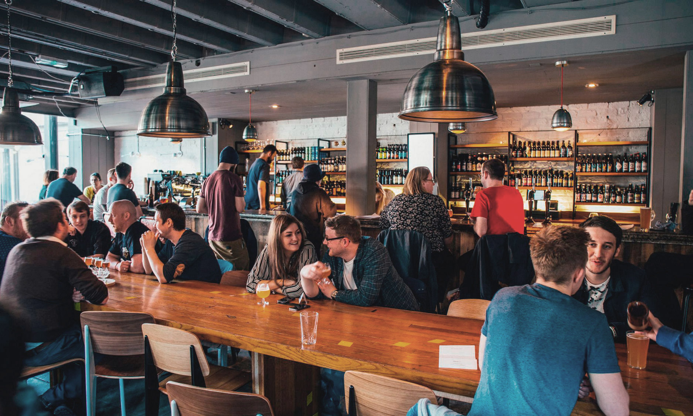
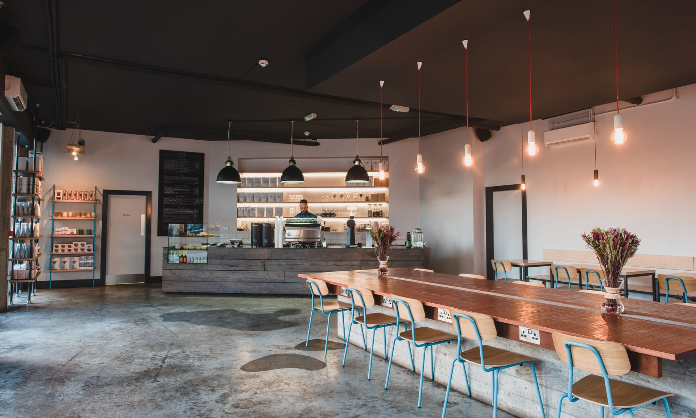
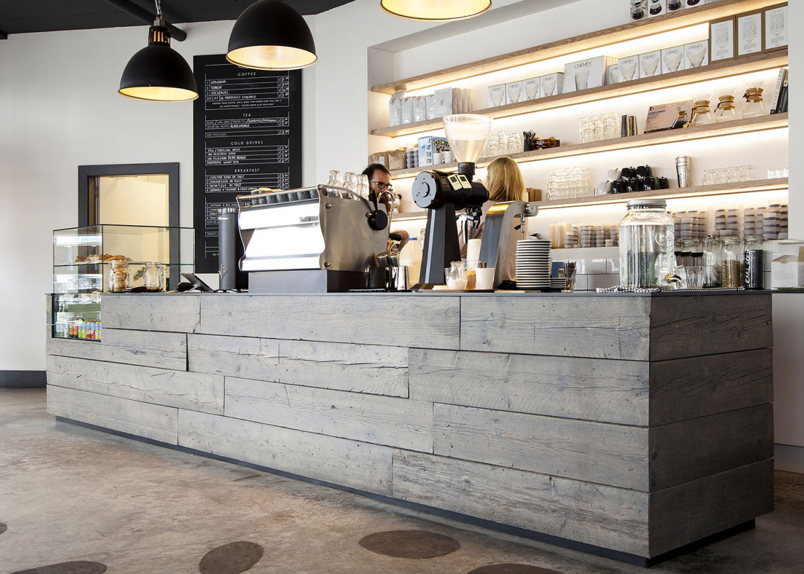
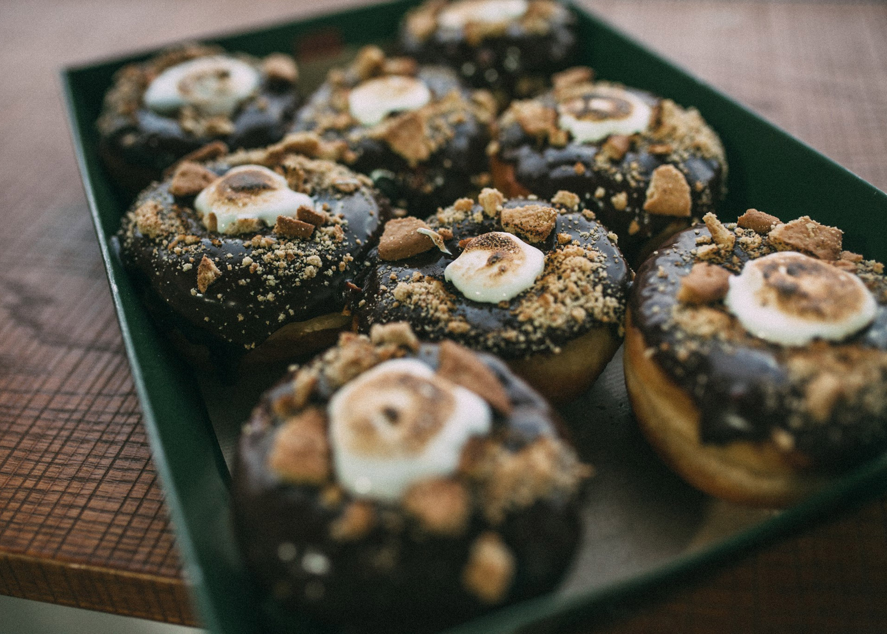
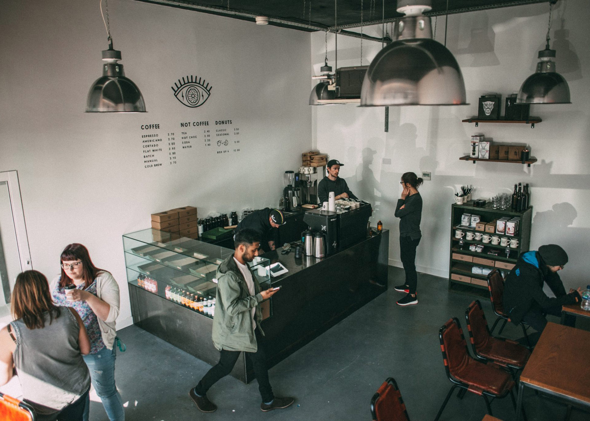
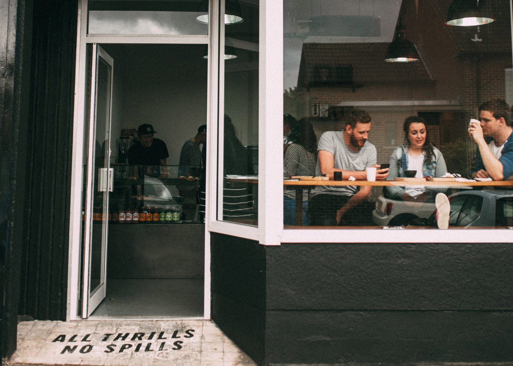
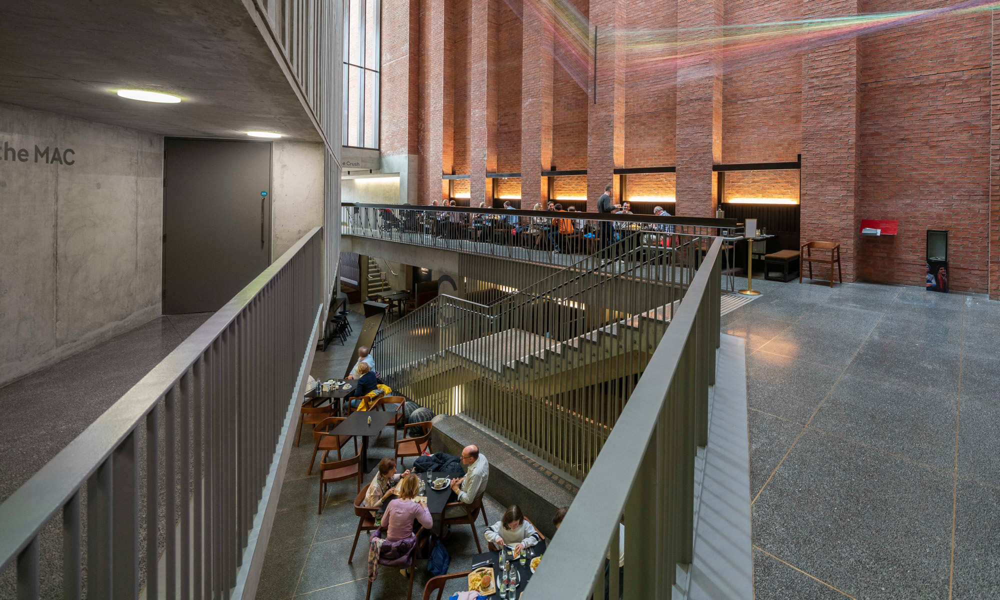
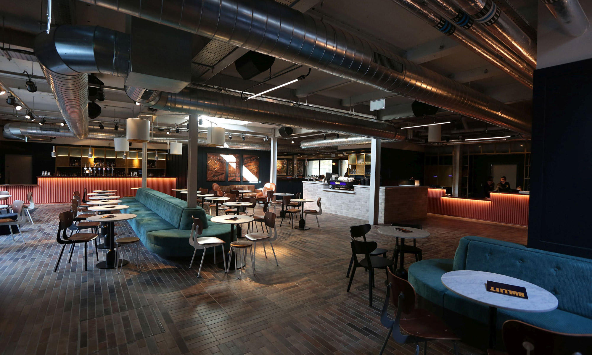
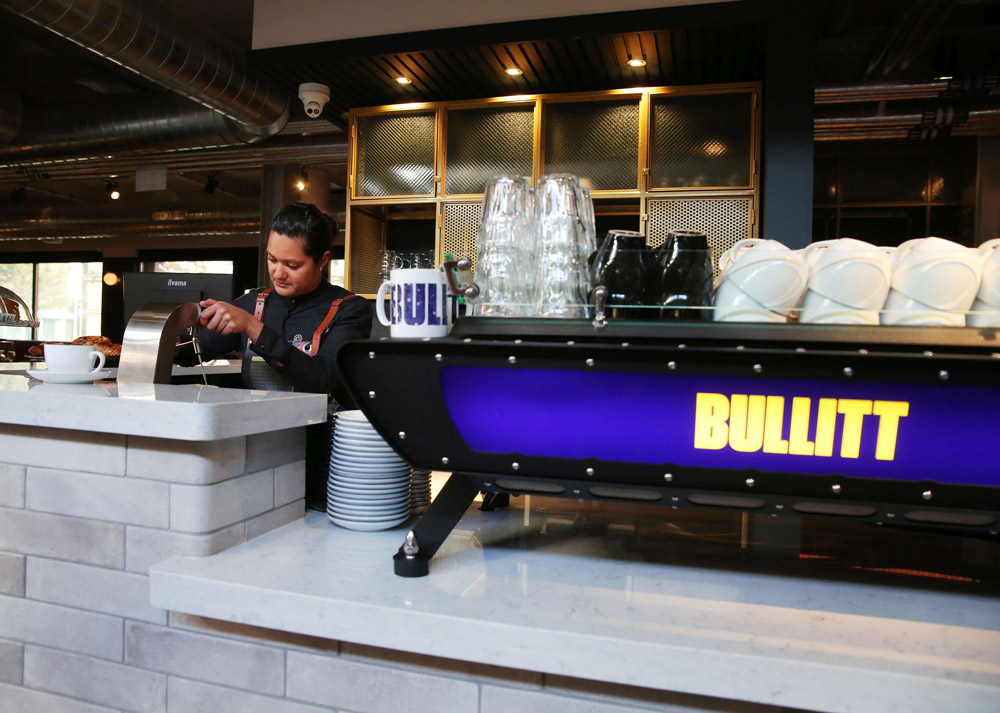
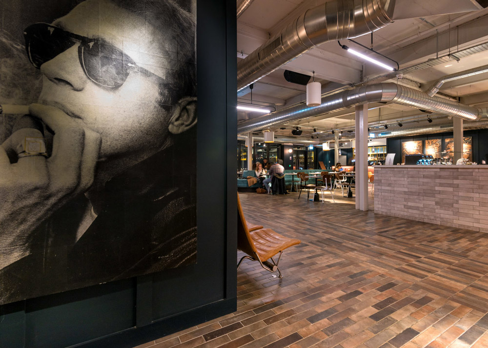

import IntroParagraph from "../../../src/components/introParagraph"
import SpaceBreakdown from "../../../src/components/spaceBreakdown"
import ArticleSpacer from "../../../src/components/articleSpacer"
import ImageRow from "../../../src/components/imageRow"
import ContentWrapper from "../../../src/components/contentWrapper"
import Reviews from "../../../src/components/reviewsRow"

<ContentWrapper>

<IntroParagraph>

Whether you're meeting a client, working remotely or just wanting to get out of the office for the day, finding the right space to work can be challenging. Will the WiFi work? Are there sockets to charge my laptop? What are the food and drink options?

</IntroParagraph>

To prevent the tedium of trial and error, we’ve narrowed down our favourite spaces to work in Belfast right now, and listed some pros and cons.

</ContentWrapper>

<ArticleSpacer />

<ContentWrapper>

## Northern Lights

</ContentWrapper>

<SpaceBreakdown speed="105" rating="4.5" sockets="Some" />

<ContentWrapper>

This craft beer bar, ran by the Galway Bay Brewery chain, is located on the Ormeau Road in South Belfast. It’s a large, spacious venue with lots of natural light and plenty of places to work over two floors.

### The Pros

1. Super fast WiFi and some sockets scattered throughout to charge as you work.
2. Plenty of the best craft beer in Belfast to choose from, or there's coffee and tea if you're trying to keep focused. If you're ok with pub grub, the food's not bad either.
3. As the venue is a bar, the late opening hours make it a good option for somewhere to work late. As long as you have some good noise cancelling headphones.

### The Cons

1. This venue is a popular bar and restaurant. So, although it can be quiet enough to work there during the day and at certain times or on certain days- sometimes it’s going to get pretty lively.
2. Again, this venue is a bar. The toilets aren’t terrible, but I will stress this again, it is a bar. These are bar toilets.
3. Northern Lights is located on the Ormeau Road, an approximate 32-minute walk from Belfast City Hall. A great option if you’re in the South Belfast area, not so central if you aren’t.

</ContentWrapper>

<Reviews google="4.5" tripadvisor="4.0" foursquare="7.7" />

<ContentWrapper>

## Established Coffee

</ContentWrapper>

<SpaceBreakdown speed="45" rating="4.6" sockets="Many" />

<ContentWrapper>

Self-professed purveyors of fine coffee in Belfast’s Cathedral Quarter, Established is a popular place to work and meetup in Belfast’s city centre. They serve hot drinks, pastries and a small but elaborate [food menu](https://established.coffee/menu) in a small but deceptively spacious and bright venue. Check out their immaculate [Instagram page](https://www.instagram.com/establishedcoffee/) to get a feel for the space.

### The Pros

1. Conveniently located just a 10&mdash;15 minute walk from Belfast City Hall (and a whopping 1 minute walk away from The MAC), Established Coffee sits at the bottom of Hill Street in Belfast’s scenic Cathedral Quarter.
2. There are many sockets available within this minimalistic, industrial style cafe and the WiFi is fast and reliable.
3. Established is open early, from 7am&mdash;6pm on weekdays and surprisingly early on weekends too. Definitely worth considering when looking for somewhere to work early.
4. They offer a selection of pastries, coffees and teas with a small food menu suitable for breakfast or a light lunch. The award-winning coffee is raved about locally, the food is too.

</ContentWrapper>

<ImageRow>

</ImageRow>

<ContentWrapper>

### The Cons

1. There’s definitely a reason for this, but Established Coffee can get very busy. To the point of queues out the door at peak hours. It's not a particularly large cafe, so spaces fill up fast.
2. The way the cafe is set up, it’s almost specifically designed to provide spaces to work. This isn’t a con, really &mdash; more of an observation. The customers who arrive in groups appear to get annoyed by people working in the group table areas. Something to be aware of, if you don’t enjoy being bitched about in reviews.

</ContentWrapper>

<Reviews google="4.6" tripadvisor="4.5" foursquare="9.4" />

<ContentWrapper>

## Guilt Trip Coffee + Donuts

</ContentWrapper>

<SpaceBreakdown speed="100" rating="4.6" sockets="Many" />

<ContentWrapper>

This coffee and donut shop, located in Belfast's trendy East Belfast area, hand bake their donuts every morning to ensure satisfaction and pay close attention to the quality of their coffee. Check out their [Manifesto](https://www.guilttripcoffee.com/about) to see what they’re all about.

### The Pros

1. Blazing fast WiFi speeds.
2. Lots of sockets available.
3. Holy shit, the donuts.
4. Fantastic coffee.

### The Cons

1. Beware the call of the donuts.
2. Limited opening times. They're not open on Mondays and don't open until 10am.
3. Their menu is limited to donuts, coffee and tea. So, if you’re looking for lunch while you work, it may not be the best option. Unless you want donuts for lunch (No judgement here, you do you).
3. The location of Guilt Trip in East Belfast isn’t terribly central, with Belfast City Hall an approximate 47-minute walk away. If you’re looking for somewhere to work in the city centre, this may not be the best option for you.
4. Despite their Vegan donuts, they do not offer milk alternatives or gluten-free options. Food intolerance sufferers are warned.

</ContentWrapper>

<ImageRow>

</ImageRow>

<Reviews google="4.6" tripadvisor="4.0" foursquare="7.8" />

<ContentWrapper>

## The MAC

</ContentWrapper>

<SpaceBreakdown speed="10" rating="4.5" sockets="Many" />

<ContentWrapper>

This large and airy arts venue boasts plenty of seating, a great atmosphere and stunning architecture. Despite its numerous events, it still manages to serve coffees, teas, food and a full bar to the general public.

### The Pros

1. Conveniently located just a 10&mdash;15 minute walk from Belfast City Hall, the size and layout of the space makes it a great place to hide away and get some work done.
2. Plenty of sockets. There are sockets available at each of the tables on the first-floor viewing gallery and others scattered throughout the building.
4. As The MAC is a charity, the proceeds from the Cafe/Bar go towards supporting the arts.

### The Cons

1. The WiFi speed isn’t ideal and can slow to a crawl when there are many people using it. If you’re looking for fast WiFi, then this may not be the best option. If you’re looking for a space to meet a client, or do less WiFi speed intensive work, then it's perfect.
2. The MAC can get pretty busy when there are events running. It’s always a good idea to check their website for event details before deciding to work here.
3. The building has great acoustics. Pro if you’re watching a performance, Con if you’re trying to concentrate. Headphones are recommended if you need to drown out other people’s conversations here.

</ContentWrapper>

<Reviews google="4.5" tripadvisor="4.5" foursquare="8.8" />

<ContentWrapper>

## Bullitt

</ContentWrapper>

<SpaceBreakdown speed="50" rating="4.3" sockets="Some" />

<ContentWrapper>

A trendy, modern themed hotel in Belfast’s city centre. Bullitt boasts boasts several bars and restaurants, meaning plenty of seating, both indoors and outdoors, to get some work done.

### The Pros

1. Another top pick for the convenient location- Bullitt is situated in Belfast City Centre, just an approximate 9-minute walk from City Hall.
2. The WiFi is fast and consistent, and you shouldn't have to look too hard to find a free socket.
3. They have a lot of well-spaced seating indoors and outdoors, with plenty of places to hide away and get some work done.
4. The opening hours are long and they have a selection of light bites that can cater to food intolerance sufferers, along with coffees and teas to keep you going.

</ContentWrapper>

<ImageRow>

</ImageRow>

<ContentWrapper>

### The Cons

1. The venue is a popular bar! So, noise levels will typically reach unworkably loud conditions during popular times like evenings and weekends.
2. I imagine it depends upon what time, and for what purpose you visit Bullitt that determines what is suitable attire &mdash; but it does appear to have a dress code.

</ContentWrapper>

<Reviews google="4.3" tripadvisor="4.0" foursquare="9.1" />

<ContentWrapper>

Did we miss your favourite spot? Been somwhere recently that you would like to suggest? Leave a comment below. 👇🏻

</ContentWrapper>
